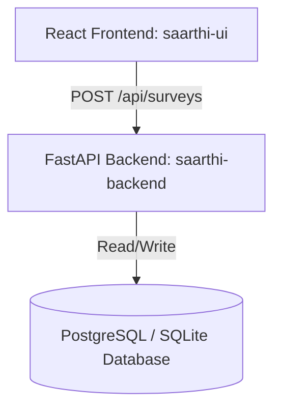

# Saarthi Project Codebase Context

This document provides a comprehensive overview of the `saarthi-backend` and `saarthi-ui` codebases.

---

## 📂 Codebase Overview

The Saarthi application consists of a React-based frontend wizard questionnaire and a FastAPI-based backend database storage service. It is designed to capture, validate, store, and query **Household Welfare & Benefits Surveys** in both **English** and **Telugu**.

---

## 1. Backend Service: `saarthi-backend`

The backend is a **FastAPI** application that provides endpoints for storing, querying, updating, and deleting survey records.

### Key Config & Entrypoints
* **[requirements.txt](file:///D:/projects/saarthi-backend/requirements.txt)**: Contains backend dependencies: `fastapi`, `uvicorn`, `sqlalchemy`, `psycopg2-binary`, `alembic`, `pydantic`, `pydantic-settings`, etc.
* **[app/config.py](file:///D:/projects/saarthi-backend/app/config.py)**: Configures project settings (e.g., project name, PORT, HOST, CORS origins, and database URL) using Pydantic Settings.
* **[app/database.py](file:///D:/projects/saarthi-backend/app/database.py)**: Configures the SQLAlchemy database engine. It checks PostgreSQL connection availability with a socket fallback, automatically falling back to a local SQLite database (`sqlite:///./local_dev.db`) if PostgreSQL is unavailable.
* **[app/main.py](file:///D:/projects/saarthi-backend/app/main.py)**: The application entrypoint. Boots the DB connection, sets up CORS middleware, and registers the REST API endpoints.

### Database Schema
* **[app/models.py](file:///D:/projects/saarthi-backend/app/models.py)**: Defines the SQLAlchemy model for `Survey` ([Class Survey](file:///D:/projects/saarthi-backend/app/models.py#L5-L27)). Key fields are extracted and indexed for fast searching:
  * `first_name` (indexed)
  * `last_name` (indexed)
  * `primary_mobile` (indexed)
  * `dob`
  * `surveyor_name` (indexed)
  * `surveyor_id` (indexed)
  * `survey_language`
  * `submitted_at`
  * `data` (JSON/JSONB column containing the full questionnaire payload)
  * `created_at` and `updated_at` timestamps

### API Endpoints
Endpoints are defined in [app/main.py](file:///D:/projects/saarthi-backend/app/main.py):
* `POST /submit` & `POST /api/surveys` ([submit_survey](file:///D:/projects/saarthi-backend/app/main.py#L62-L81)): Validates inputs against Pydantic schemas, maps fields to model attributes, and stores the record.
* `GET /records` & `GET /api/surveys` ([get_records](file:///D:/projects/saarthi-backend/app/main.py#L83-L105)): Retrieves surveys, supporting search filters for `first_name`, `primary_mobile`, and `surveyor_id` with offset-based pagination.
* `GET /records/{record_id}` ([get_record](file:///D:/projects/saarthi-backend/app/main.py#L107-L119)): Retrieves a single survey by ID.
* `PUT /records/{record_id}` ([update_record](file:///D:/projects/saarthi-backend/app/main.py#L120-L161)): Updates searchable columns or the complete nested survey JSON document.
* `DELETE /records/{record_id}` ([delete_record](file:///D:/projects/saarthi-backend/app/main.py#L163-L184)): Deletes a survey by ID.

---

## 2. Frontend Application: `saarthi-ui`

The frontend is a single-page application built on **React 19** and styled using a clean, custom CSS theme with inline React styling.

### Configuration & Styling
* **[package.json](file:///D:/projects/saarthi-ui/package.json)**: Declares dependencies like React, React-DOM, and standard testing libraries, and scripts like `npm start` and `npm run build`.
* **[src/theme.js](file:///D:/projects/saarthi-ui/src/theme.js)**: Defines the visual palette (`Warm Amber × Deep Slate` theme), input styles, label layouts, and helper colors used across the questionnaire wizard.
* **[src/App.jsx](file:///D:/projects/saarthi-ui/src/App.jsx)**: Acts as the main router, progress indicator, language controller, and manager of the central survey form state ([state INIT](file:///D:/projects/saarthi-ui/src/App.jsx#L33-L60)).

### Wizard Questionnaire Sections
The questionnaire is divided into 11 sections (Sections A to K), each imported and rendered conditionally based on the active tab:
* **[SectionA.jsx](file:///D:/projects/saarthi-ui/src/sections/SectionA.jsx)**: Identity & Address (First/Last names, primary mobile, DOB, residential details, and Aadhaar consent/number).
* **[SectionB.jsx](file:///D:/projects/saarthi-ui/src/sections/SectionB.jsx)**: Household Information (Family size counts, family structures, and dynamic sub-table for family member relationships, age, gender, education, and income).
* **[SectionC.jsx](file:///D:/projects/saarthi-ui/src/sections/SectionC.jsx)**: Employment & Livelihood (Main occupations, secondary income sources, nature of employment, and challenges faced).
* **[SectionD.jsx](file:///D:/projects/saarthi-ui/src/sections/SectionD.jsx)**: Income & Financial Status (Monthly/annual income ranges, savings presence, insurance, and details of outstanding debt).
* **[SectionE.jsx](file:///D:/projects/saarthi-ui/src/sections/SectionE.jsx)**: Assets & Living Conditions (Housing types, ownership, land, livestock, vehicle and device counts, and primary amenities like drinking water, electricity, toilet, etc.).
* **[SectionF.jsx](file:///D:/projects/saarthi-ui/src/sections/SectionF.jsx)**: Education (Sub-table detailing education status/qualifications for all household members and dropout reasons).
* **[SectionG.jsx](file:///D:/projects/saarthi-ui/src/sections/SectionG.jsx)**: Health & Disability (Tables detailing chronic illnesses, treatment costs, disabilities, and healthcare accessibility barriers).
* **[SectionH.jsx](file:///D:/projects/saarthi-ui/src/sections/SectionH.jsx)**: Government Schemes & Welfare (Current government scheme benefits, potential eligibility, and most-needed welfare resources).
* **[SectionI.jsx](file:///D:/projects/saarthi-ui/src/sections/SectionI.jsx)**: Documents & Digital Access (Presence and validity of documents like Aadhaar, PAN, Voter ID, Caste/Income certificates, and smartphone digital capabilities).
* **[SectionJ.jsx](file:///D:/projects/saarthi-ui/src/sections/SectionJ.jsx)**: Social & Community Information (Alternative contact details, communication preferences, and community roles).
* **[SectionK.jsx](file:///D:/projects/saarthi-ui/src/sections/SectionK.jsx)**: Consent Declaration (Surveyor signature, GPS/location details, consent date, and final submit button).

### Validations & Submissions
* **[validateSection](file:///D:/projects/saarthi-ui/src/App.jsx#L67)**: Validates each section dynamically before permitting navigation to subsequent tabs. Includes checks for uppercase starting letters, phone lengths, Aadhaar formats, matching household head counts vs. table row counts, and conditional mandatory fields.
* **[handleSubmit](file:///D:/projects/saarthi-ui/src/App.jsx#L892)**: Handles submitting the survey payload. It attempts to POST to the main server `http://localhost:4000/api/surveys` first, with a fallback to `http://localhost:8000/api/surveys` if the primary address is unreachable.
